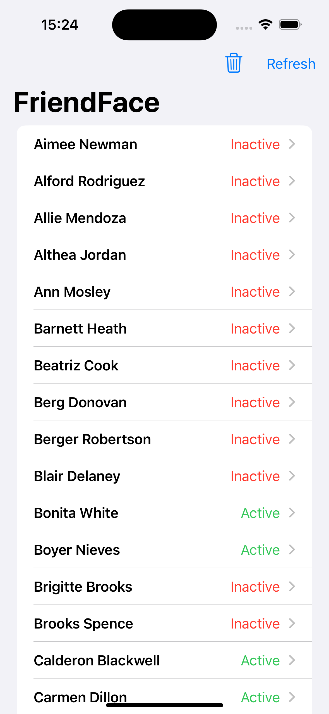
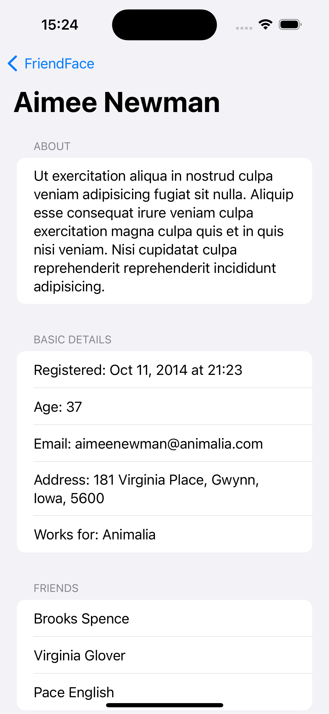

# FriendFace SwiftData - 100 Days of SwiftUI

## Overview

Welcome to FriendFace SwiftData! This project is part of the 100 Days of SwiftUI series.

## Introduction

FriendFace is a simple JSON fetching app. This project will help you learn the fundamentals of SwiftUI and SwiftData, two powerful tools for iOS development.

## Setup and Installation

To get started with FriendFace, you will need:

- Xcode 12 or later
- A basic understanding of Swift programming
- An enthusiasm for learning SwiftUI and SwiftData

## Screenshots

## Credits
- **Developer:** Om Preetham Bandi
- **Framework:** SwiftUI

## License
This project is licensed under [LICENSE](LICENSE)
